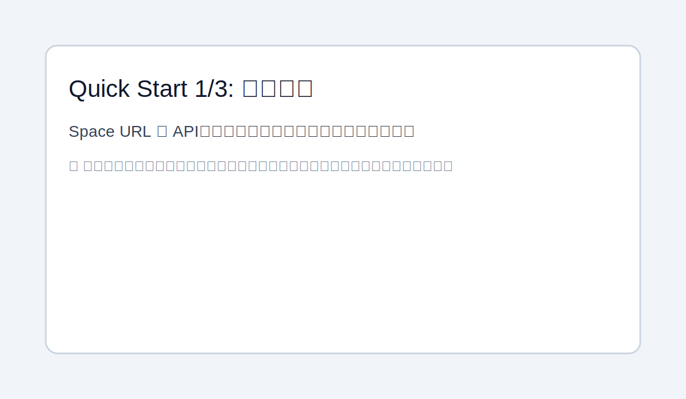
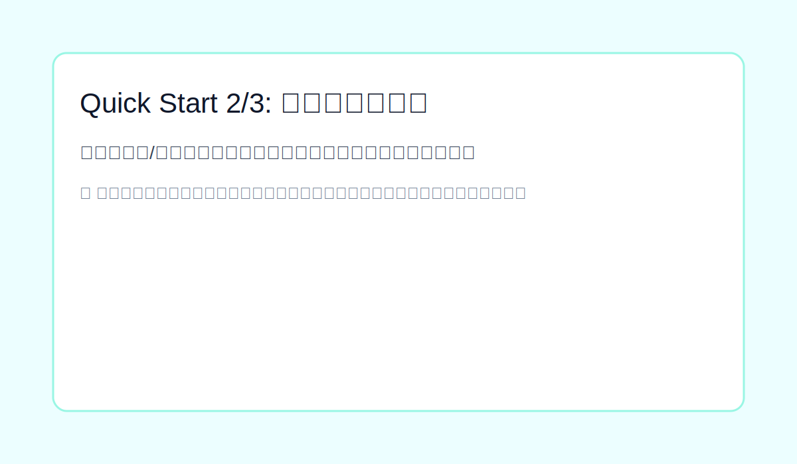
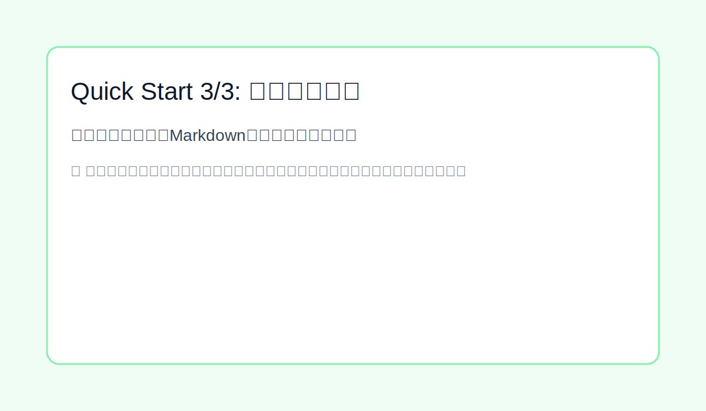

# BaklogMD Desktop (Tauri)

Backlogの課題を取得し、Markdown形式でローカル保存するmacOS向けデスクトップアプリです。

## 1. 機能概要

- Space URL / APIキーの初期設定
- `/api/v2/users/myself` による接続テスト
- プロジェクト同期
- 課題検索（課題キー / キーワード）
- Backlog記法の一部をMarkdownへ変換
- Markdownエクスポート（重複時は連番保存）
- エクスポート履歴表示・履歴削除
- オンライン優先、失敗時キャッシュ表示

## 2. 技術スタック

- UI: React + TypeScript + Vite
- App Layer: Tauri (Rust)
- Storage: SQLite
- Secret: macOS Keychain

## 3. 必要環境（macOS）

- macOS
- Xcode Command Line Tools（Tauri/Rustのネイティブビルドに必要）
- Node.js 18+（推奨: LTS）
- Rust（rustup経由）

## 4. 初回セットアップ

### 4.1 依存ツールをインストール

```bash
xcode-select --install
brew install node
curl --proto '=https' --tlsv1.2 -sSf https://sh.rustup.rs | sh
```

### 4.2 RustのPATHを有効化

```bash
source "$HOME/.cargo/env"
```

`cargo` が見つからない場合は `~/.zshrc` に追記してください。

```bash
echo 'export PATH="$HOME/.cargo/bin:$PATH"' >> ~/.zshrc
source ~/.zshrc
```

### 4.3 バージョン確認

```bash
node -v
npm -v
cargo --version
```

### 4.4 依存インストール（モノレポルートで実行）

```bash
cd <このリポジトリのルート>
npm install
```

## 5. 開発起動

リポジトリルートから:

```bash
cd <このリポジトリのルート>
source "$HOME/.cargo/env"
npm run desktop:tauri
```

`apps/desktop` 配下で直接起動する場合:

```bash
cd apps/desktop
source "$HOME/.cargo/env"
npm run tauri dev
```

停止は実行中ターミナルで `Ctrl + C`。

## 6. 初回利用手順（GUI）

1. 初期設定画面で以下を入力
- Space URL: 例 `https://tda-career.backlog.com`
- APIキー: Backlogで発行した個人APIキー

2. `保存して接続テスト` を実行
3. `同期` を押してプロジェクト一覧取得
4. 課題検索（キーワード / 課題キー）
5. 課題詳細を選択
6. `保存先を選択` でディレクトリを設定
7. `Markdownエクスポート` を実行

## 7. データ保存場所

- Keychain
- APIキーのみ保存
- Service: `com.company.backlog-markdown-exporter`
- Account: `backlog-api-key`

- SQLite
- パス: `~/Library/Application Support/com.company.backlog-markdown-exporter/app.db`
- 保存内容: `space_url`、`export_dir`、キャッシュ、履歴

## 8. セキュリティ方針

- APIキーはKeychainのみ保存（DB保存しない）
- DBには機密情報を保存しない
- APIキーはログに出力しない

## 9. エラーコード

- `AUTH_INVALID`: APIキー不正
- `FORBIDDEN`: 権限不足
- `NETWORK`: ネットワーク障害
- `RATE_LIMIT`: API制限
- `KEYCHAIN`: Keychain操作失敗
- `NOT_FOUND`: データ未検出

## 10. よくあるトラブル

### `cargo: command not found`

```bash
source "$HOME/.cargo/env"
```

### `KEYCHAIN` エラーが出る

- 初期設定でAPIキーを再保存
- macOSのキーチェーンアクセス許可を確認
- 必要なら認証情報をリセットして再設定

### エクスポート先ダイアログが出ない/反応が薄い

- `保存先を選択` で先に保存先ディレクトリを設定
- エクスポート結果はボタン付近のメッセージで確認

## 11. ビルド

リポジトリルートから:

```bash
cd <このリポジトリのルート>
source "$HOME/.cargo/env"
npm run desktop:build
```

配布手順は `docs/release.md` を参照してください。

## 12. 3分クイックスタート（スクリーンショット付き）

### Step 1: 初期設定

1. Space URL（例: `https://tda-career.backlog.com`）とAPIキーを入力
2. `保存して接続テスト` を押す



### Step 2: 課題検索と詳細表示

1. 検索モード（キーワード/課題キー）を選択
2. 条件を入力して `検索`
3. 結果リストをクリックして課題詳細を表示



### Step 3: Markdownエクスポート

1. `保存先を選択` で出力先ディレクトリを設定
2. `Markdownエクスポート` を実行
3. エクスポート履歴で結果を確認



### スクリーンショット差し替え方法

- 画像ファイルを `docs/images/quickstart-01-setup.svg` など同名で置き換えるだけで表示が更新されます。
- 実スクリーンショットを使う場合は `.png` でも問題ありません（README内の拡張子を合わせて変更）。
